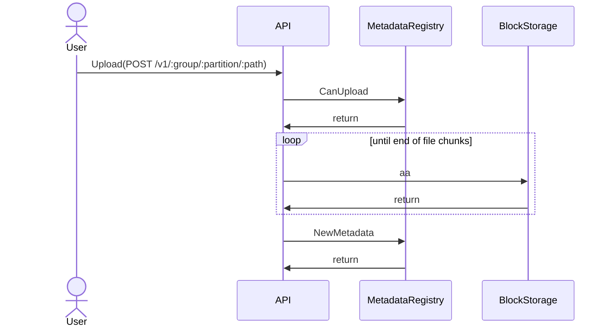

```mermaid
sequenceDiagram
    actor user as User
    participant api as API
    participant metadata as MetadataRegistry
    participant storage as BlockStorage


    user->>api: Upload(POST /v1/:group/:partition/:path)

    api->>metadata: CanUpload
    metadata->>api: return

    loop until end of file chunks
        api->>storage: aa
        storage->>api: return
    end

    api->>metadata: NewMetadata
    metadata->>api: return


```
