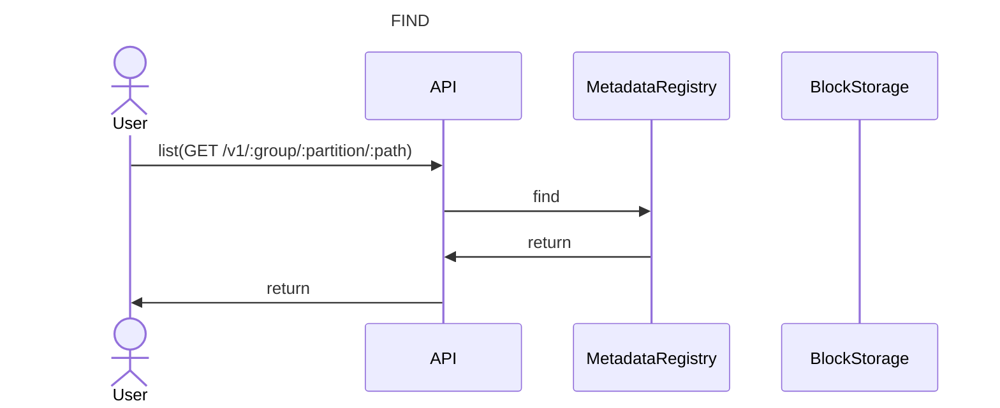
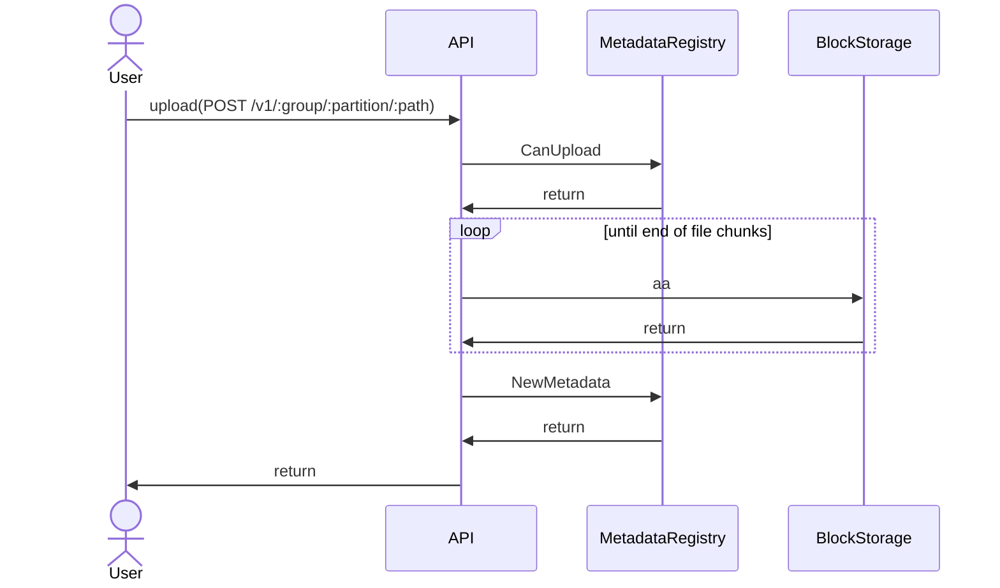
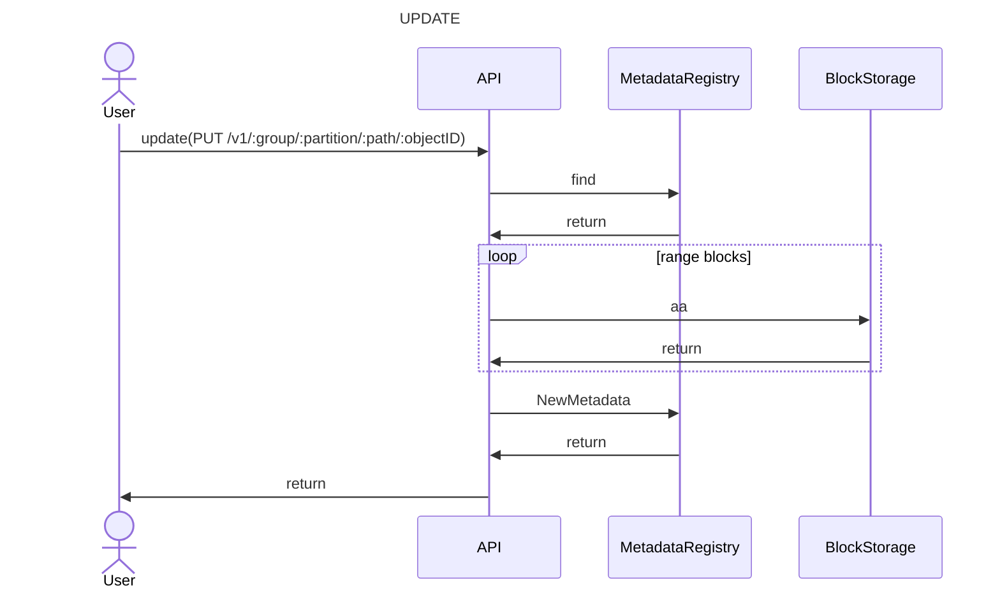
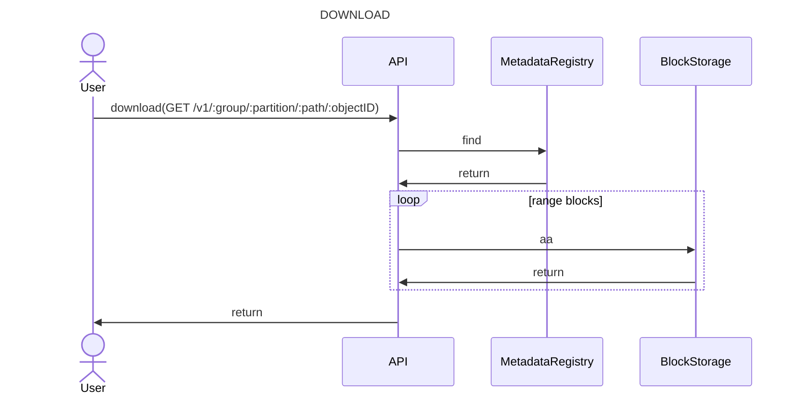
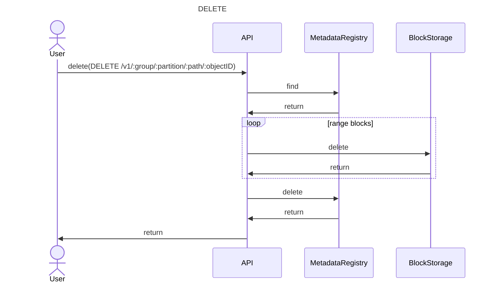

### Sequence Diagram

```mermaid
---
title: FIND
---

sequenceDiagram
    actor user as User
    participant api as API
    participant metadata as MetadataRegistry
    participant storage as BlockStorage

    user->>api: list(GET /v1/:group/:partition/:path)

        api->>metadata: find
        metadata->>api: return

    api->>user: return
```

```mermaid
---
title:UPLOAD
---

sequenceDiagram
    actor user as User
    participant api as API
    participant metadata as MetadataRegistry
    participant storage as BlockStorage

    user->>api: upload(POST /v1/:group/:partition/:path)

        api->>metadata: CanUpload
        metadata->>api: return

        loop until end of file chunks
            api->>storage: aa
            storage->>api: return
        end

        api->>metadata: NewMetadata
        metadata->>api: return

    api->>user: return
```

```mermaid
---
title: UPDATE
---

sequenceDiagram
    actor user as User
    participant api as API
    participant metadata as MetadataRegistry
    participant storage as BlockStorage

    user->>api: update(PUT /v1/:group/:partition/:path/:objectID)

        api->>metadata: find
        metadata->>api: return

        loop range blocks
            api->>storage: aa
            storage->>api: return
        end

        api->>metadata: NewMetadata
        metadata->>api: return

    api->>user: return
```

```mermaid
---
title: DOWNLOAD
---

sequenceDiagram
    actor user as User
    participant api as API
    participant metadata as MetadataRegistry
    participant storage as BlockStorage

    user->>api: download(GET /v1/:group/:partition/:path/:objectID)

        api->>metadata: find
        metadata->>api: return

        loop range blocks
            api->>storage: aa
            storage->>api: return
        end

    api->>user: return
```

```mermaid
---
title: DELETE
---

sequenceDiagram
    actor user as User
    participant api as API
    participant metadata as MetadataRegistry
    participant storage as BlockStorage

    user->>api: delete(DELETE /v1/:group/:partition/:path/:objectID)

        api->>metadata: find
        metadata->>api: return

        loop range blocks
            api->>storage: delete
            storage->>api: return
        end

        api->>metadata: delete
        metadata->>api: return

    api->>user: return
```
